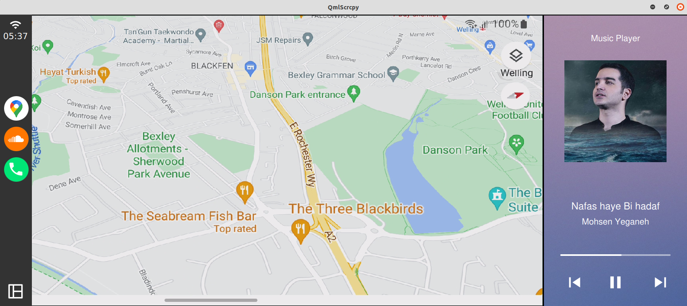
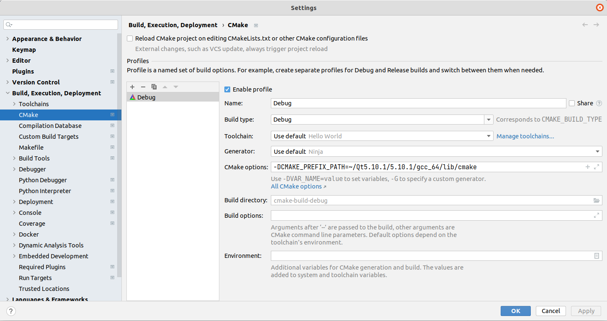

## QmlScrcpy

This application show content android screen (video) connected via USB or over Wi-Fi.
and allows to control the device with the keyboard and the mouse of the computer. It does not require any root access. 
It works on Linux.

[Here is a video show how qmlscrcpy work](https://qmlscrcpy.s3.ir-thr-at1.arvanstorage.ir/QmlScrcpy-V0.0.1-alpha.mp4)


<div >
  <a href="https://github.com/othneildrew/Best-README-Template">
    
  </a>
</div>

<div >
  <a href="https://github.com/othneildrew/Best-README-Template">
    
  </a>
</div>

### scrcpy vs QmlScrcpy

| Item            |     Scrcpy     |     QmlScrcpy     |
|:----------------|:--------------:|:-----------------:|
| ui              |      SDL       |        QML        |
| video encode    |     ffmpeg     |      ffmpeg       |
| video render    |      SDL       | OpenGL inside Qml |
| language        |       C        |        C++        |
| build           | meson + gradle |       CMake       |
| Android Manager |       -        |        Yes        |

### features:
* lightness: native, displays only the device screen
* performance: 30~120fps, depending on the device
* quality: 1920×1080 or above
* low latency: 35~70ms
* low startup time: ~1 second to display the first image


### Qml Benefits
* You can embed [scrcpy](https://github.com/Genymobile/scrcpy) inside your qml project
* Screen buffers are render by native OpenGl inside Qml, No requirement to external library similar GStreamer or LibVlc 
* You can use Animation, Scale, Rotation , Resize and ... similar other qml componnets.


## Requirements

Install the required packages from your package manager.
```
sudo apt install ffmpeg
```


My Ubuntu Version
```
lsb_release -a
No LSB modules are available.
Distributor ID:	Ubuntu
Description:	Ubuntu 20.04.4 LTS
Release:	20.04
Codename:	focal
```

ADB version must 31 or above
```
adb --version
Android Debug Bridge version 1.0.41
Version 31.0.3-7562133
Installed as /usr/lib/android-sdk/platform-tools/adb
```

Download & Install Qt 5.10.1
```
cd ~/
wget https://download.qt.io/new_archive/qt/5.10/5.10.1/qt-opensource-linux-x64-5.10.1.run
sudo chmod 755 qt-opensource-linux-x64-5.10.1.run
./qt-opensource-linux-x64-5.10.1.run
```

[Clion IDE](https://www.jetbrains.com/clion/)
``` 
My Clion version is 2022.3.3
```

Add Qt5.10.1 path to cmake
```
 Clion --> File --> Settings --> Build, Execution, Deployment --> CMake
 
-DCMAKE_PREFIX_PATH=~/Qt5.10.1/5.10.1/gcc_64/lib/cmake
```


<div >
  <a href="https://github.com/othneildrew/Best-README-Template">
    
  </a>
</div>

